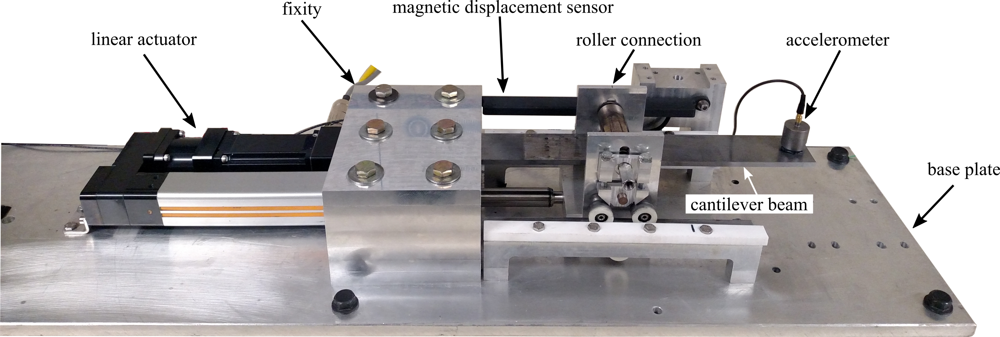
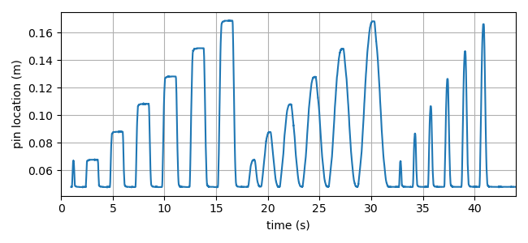
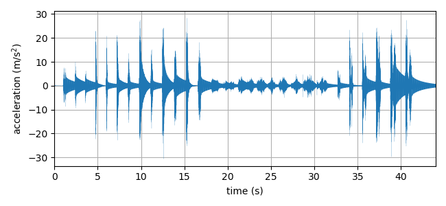

# Dataset-2-DROPBEAR-Acceleration-vs-Roller-Displacement

This data set consists of acceleration data measured from the Reproduction of Projectiles in Ballistic Environments for Advanced Research (DROPBEAR) experimental testbed with movable roller support as shown in figure 1. DROPBEAR consists of a 51 x 6 x 350 mm beam with a single accelerometer (model 393B04 manufactured by PCB Piezotronics) mounted at the free edge of the beam was used. A video of the test along can be found <a href="https://www.youtube.com/watch?v=ZB6AUWgWyJU&ab_channel=ARTS-LabattheUniversityofSouthCarolinaARTS-LabattheUniversityofSouthCarolina">here</a>.

  

Figure 1: The Dynamic Reproduction of Projectiles in Ballistic Environments for Advanced Research (DROPBEAR) experimental testbed with key components annotated (click the image to view the video on YouTube). 

The roller followed a predefined profile that ranged from 48 mm (closest to the fixity) to 175 mm as presented in the inset of Figure 2. The beam is self-excited by the roller's movements and therefore no extraneous inputs are required, however, this does require an initial input to the beam, which consists of a small roller movement, to initiate vibrations in the beam. In addition to this initial input, the test profile consists of six square wave inputs of increasing amplitude in addition to six sinusoidal inputs and six impulse inputs. For the cases of the square and impulse inputs, the actuator velocity was maximized to the extent allowed by the actuator and associated controller (250 mm/s). The measured vibration data is shown in figure 3.

Figure 2: Displacement of roller used in the generation of this dataset. 

The measured vibration data is shown in figure 3.  Data acquisition was performed using a 14-bit ADC (PXI-6133) for the linear transducer (SPS-L225-HALS manufactured by Honeywell) while acceleration data was acquired using a 24-bit IEPE ADC (NI-9234).

Figure 3: Measured acceleration data for this data set. 

This data set originally published in Downey et al. "Millisecond Model Updating for Structures Experiencing Unmodeled High-rate Dynamic Events." Mechanical Systems and Signal Processing, vol. 138, 2020, p. 106551, doi:10.1016/j.ymssp.2019.106551. Published as (Distribution A. Approved for public release; distribution unlimited (96TW-2019-0372).

## Notes

This data set has subsequently been used in the following publications:
1. Austin Downey, Jonathan Hong, Jacob Dodson, Michael Carroll, and James Scheppegrell, "Millisecond Model Updating for Structures Experiencing Unmodeled High-rate Dynamic Events." Mechanical Systems and Signal Processing, vol. 138, 2020, p. 106551, doi:10.1016/j.ymssp.2019.106551.

1. Seong Hyeon Hong, Claire Drnek, Austin Downey, Yi Wang, Jacob Dodson, and Jonathan Hong., "Real-time Model Updating Algorithm for Structures Experiencing High-rate Dynamic Events." Proceedings of the ASME 2020 Conference on Smart Materials, Adaptive Structures and Intelligent Systems (SMASIS 2020), 2020, doi:10.1115/smasis2020-2439

1. Claire Rae Drnek, "Local Eigenvalue Modification Procedure for Real-time Model Updating of Structures Experiencing High-rate Dynamic Events." University of South Carolina, 2020, University of South Carolina Graduate Theses and Dissertations.

Cite this data as: 

Austin Downey, Jonathan Hong, Jacob Dodson, Michael Carroll, and James Scheppegrell, “Dataset-2-dropbearacceleration-vs-roller-displacement,” Dec. 2021. [Online]. Available: https://github.com/High-Rate-SHM-Working-Group/Dataset-2-DROPBEAR-Acceleration-vs-Roller-Displacement

@Misc{Downey2021Dataset2Dropbear,  
  author = {Austin Downey and Jonathan Hong and Jacob Dodson and Michael Carroll and James Scheppegrell},  
  month  = dec,  
  title  = {Dataset-2-DROPBEAR-Acceleration-vs-Roller-Displacement},  
  year   = {2021},  
  groups = {High-Rate-SHM-Working-Group},  
  url    = {https://github.com/High-Rate-SHM-Working-Group/Dataset-2-DROPBEAR-Acceleration-vs-Roller-Displacement},  
}  

